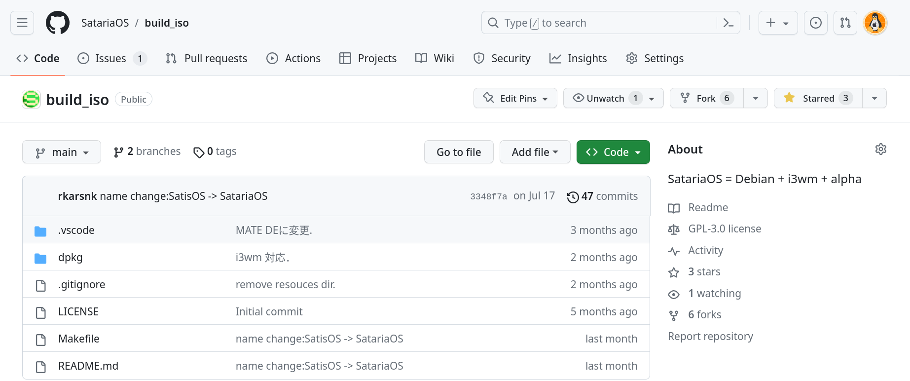

<!-- _class: lead -->
<!-- paginate: false -->
#### 東京エリア・関西合同Debian勉強会
# Live Buildを使った<br>カスタムフレーバの作成

**カナやん**
2023/08/19

---

<!-- _header: 目次 -->
<!-- paginate: true -->
1. はじめに
1. Live Build とは
1. Live Build の導入
1. Live Build によるビルドの流れ
1. カスタムの例


---

<!-- _header: 自己紹介 -->
- カナやん
    - Twitter(現X): rkarsnk
    - mastodon: rkarsnk\@mastdn.jp
- 主に利用しているOS
    - macOS
    - Debian 12
- はじめて触ったLinuxはPlamo Linux 1.4(Linux/98 2.1)

**本日のDebian勉強会では、Live Build を利用して、自分好みのカスタムフレーバを作成する方法について説明します**

---
<!-- _header: はじめに -->
- 開発コミュニティのおかげで，DebianやopenSUSE，Rocky Linux のように安定して利用できるdistroが入手できる 
- こうしたdistroでは、決まった構成のデスクトップ環境が提供されている
- 定食も悪くないが、好きなものを組み合わせたデスクトップ環境が欲しい




---
<!-- _header: Live Build とは -->
- Live Build とは、Debian Live Team$^{1}$が開発・メンテナンスしているLive Imageを作成するツール
- 何をしてくれるツールなのか
    - debootstrapで取得したrootfsに
    - GUI環境などのパッケージを導入し
    - xorrisoでISO化する
- Debian 12からは、このツールを利用して、GNOME/KDE/Xfce/MATEなどの公式ライブインストールイメージが作成され配布されている$^{2}$

>1 https://salsa.debian.org/live-team
>2 https://cdimage.debian.org/debian-cd/12.1.0-live/amd64/
    

---
<!-- _header: Live Buildの導入 -->
Debian 12 がインストールされたPCに，Live Buildをインストール
```
$ sudo apt install live-build
```

```
$ lb -u
live-build - Utility to build live systems

Usage:

  lb {clean|config|build}
  lb [-h|--help]
  lb [-u|--usage]
  lb [-v|--version]

Try "lb --help" for more information.
```

---
<!-- _header: Live Build によるビルドの流れ -->
Live Build を利用したカスタムフレーバのビルド手順は以下
1. `lb config` でconfigディレクトリ作成(オプション指定必要)
1. configディレクトリに設定を追加する(カスタムはここでやる)
1. `lb build` でビルド(ビルドが成功するの祈るだけ)



---
<!-- _header: lb config -->

```
$ mkdir live
$ cd live
$ lb config \
	--architecture amd64 \
	--distribution bookworm  \
	--mirror-chroot "http://deb.debian.org/debian" \
	--archive-areas "main contrib non-free non-free-firmware" \
	--bootappend-live "boot=live components debug=1" \
	--image-name "Live-Image"
$ ls -F
auto/  config/  local/
```
- 上の実行例では，amd64なBookwormをベースとしたライブイメージを作成するためのconfigディレクトリを作成している
- 指定するオプションの詳細については，`man lb_config`を参照
---
<!-- _header: configディレクトリ -->
```
$ ls -F config/
apt/          common               includes.chroot_after_packages/   packages.binary/
archives/     debian-installer/    includes.chroot_before_packages/  packages.chroot/
binary        hooks/               includes.installer/               preseed/
bootloaders/  includes/            includes.source/                  rootfs/
bootstrap     includes.binary/     package-lists/                    source
chroot        includes.bootstrap/  packages/
```
- `binary`,`bootstrap`,`chroot`,`common`,`source` は生成された設定ファイル
- `package-lists/`はインストールパッケージのリストを置く場所
- `includes.chroot_after_packages/` はパッケージが展開されたchroot環境に上書きするファイルを置く場所

---
<!-- _header: lb build -->
- lb buildは以下の5つの処理からなる
    - lb bootstrap
        - 基本となるDebianのrootファイルシステムを構築する(debootstrap)
    - lb chroot
        - `package-lists/`以下のパッケージリストを元にLiveOS システムを構築する
    - lb installer 
        - (オプション) Debian Installerを利用する場合に実行される．
    - lb binary
        - Live Image (ISO)をビルドする(xorriso)
    - lb source
        - (オプション) 対応するソースイメージをビルドする．

---
<!-- _header: カスタム例 SatariaOS -->
- 個人的に自分のために作っているカスタムフレーバ
- ビルド用のソースコードはGitHubにあります
    - https://github.com/SatariaOS/build_iso



---
<!-- _header: SatariaOSの仕様 -->
- ベースはDebian Bookworm
- WMはタイル型ウィンドウマネージャのi3wm
    - 事前に好みの設定を~/.config/i3に追加する
- DMはLightDM
- インストーラはCalamares
    - CalamaresはDebian公式LiveISOでも採用
    - `calamares-settings-debian`をベースにSatariaOS用のパッケージを作成済み

---
<!-- _header: まとめ -->
